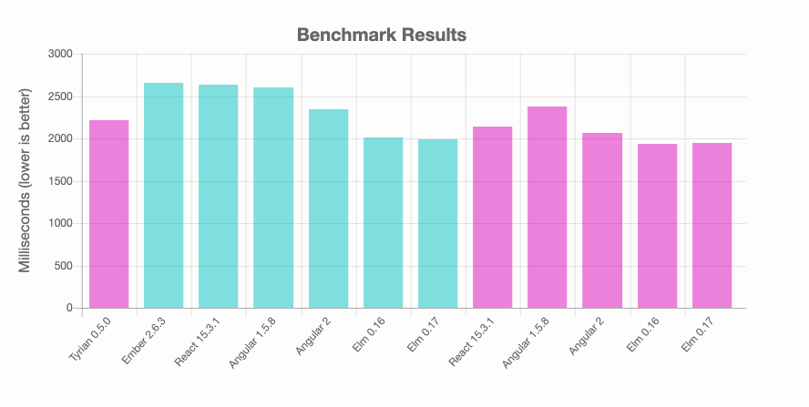

# Tyrian • [TodoMVC](http://todomvc.com)

> Tyrian is an Elm-inspired, purely functional web framework for Scala 3. Its purpose is to make building interactive websites in Scala 3 fun! Tyrian allows you to describe web pages and complex interactions in a way that is elegant, easy to read and easy to reason about.

This is an implementation of the standard TodoMVC project using Tyrian, which acts as a rosetta stone for most common JavaScript frameworks.

You can see if running [here](https://purplekingdomgames.github.io/tyrian-todo/).

## Resources

- [Website](https://tyrian.indigoengine.io/)
- [Documentation](https://tyrian.indigoengine.io/concepts/guided-tour/)

### Support

- [Twitter](https://twitter.com/indigoengine)
- [Discord](https://discord.gg/b5CD47g)

*Let us [know](https://github.com/PurpleKingdomGames/tyrian/issues) if you discover anything worth sharing.*

## Implementation

This project was built using the official TodoMVC [template](https://github.com/tastejs/todomvc-app-template) and [specification](https://github.com/tastejs/todomvc/blob/master/app-spec.md), and is based on the standard `tyrian.g8` project. To begin your own project the same way, enter the following on your command line:

`sbt new PurpleKingdomGames/tyrian.g8`

## Performance

I've set up the performance test runner just for some idea of a speed comparison.

Three caveats:

1. I'm running it on my machine!
2. The Tyrian test is a bit flakey. The tests results are consistent _but_ the test doesn't always complete. I have an idea why...
3. Please note that the comparisons are being made against the other frameworks the runner was bundled with, which are all a good few versions out of date.

Still. Not bad.



## Credit

Created by [Dave Smith](https://github.com/davesmith00000)

---

## Running Locally

To run the program in a browser you will need to have yarn (or npm) installed.

Before your first run and for your tests to work, **you must** install the node dependencies with:

```sh
yarn install
```

This example uses Parcel.js as our bundler and dev server, there are lots of other options you might prefer like Webpack, scalajs-bunder, or even just vanilla JavaScript.

We recommend you have two terminal tabs open in the directory containing this README file.

In the first, we'll run sbt.

```sh
sbt
```

From now on, we can recompile the app with `fastOptJS` or `fullOptJS` _**but please note** that the `tyrianapp.js` file in the root is expecting the output from `fastOptJS`_.

Run `fastOptJS` now to get an initial build in place.

Then start your dev server, with:

```sh
yarn start
```

Now navigate to [http://localhost:1234/](http://localhost:1234/) to see your site running.

If you leave parcel's dev server running, all you have to do is another `fastOptJS` or `fullOptJS` and your app running in the browser should hot-reload the new code.
